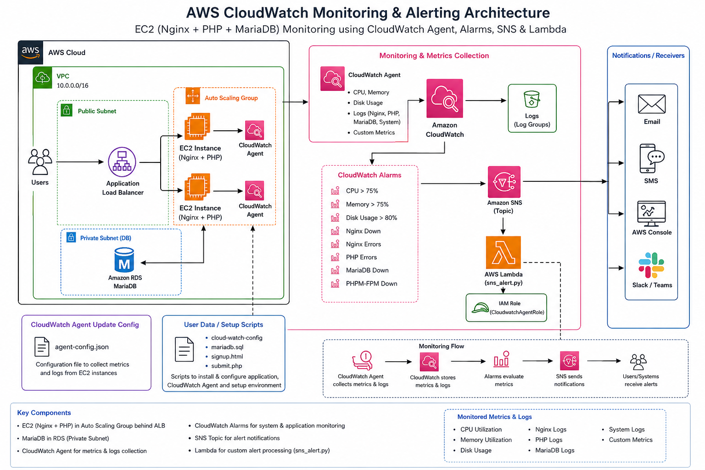
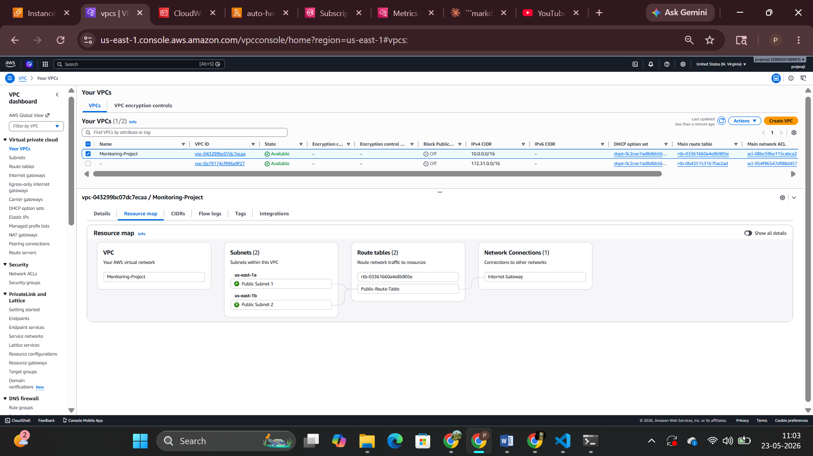
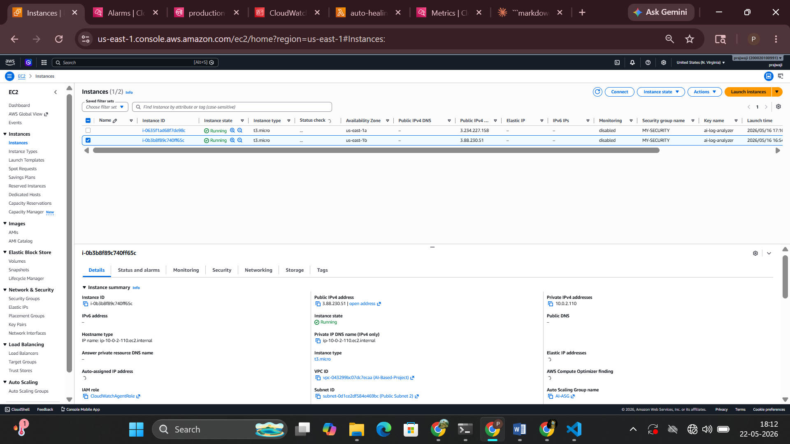
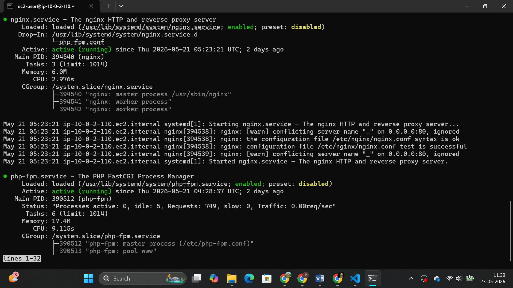
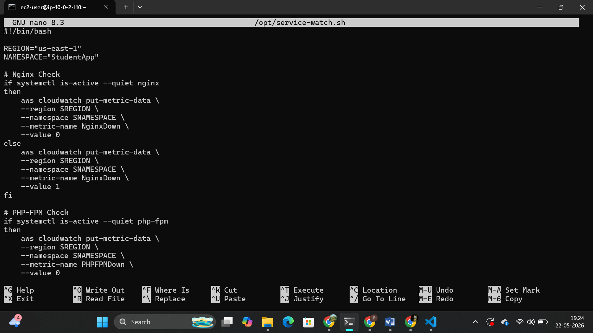
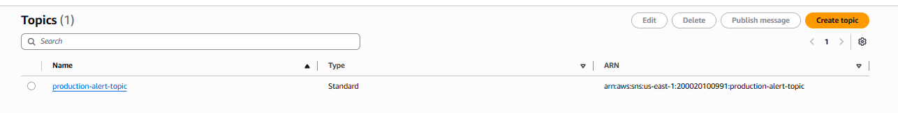
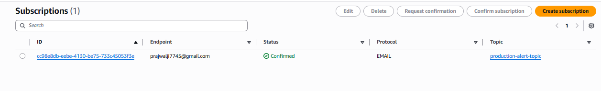
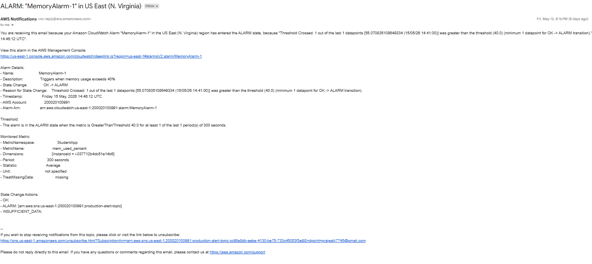
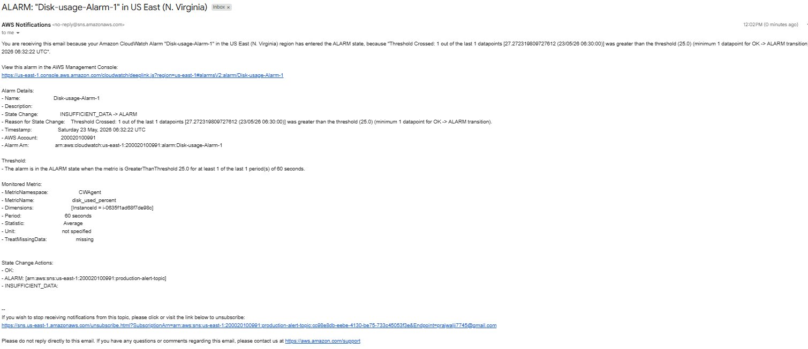
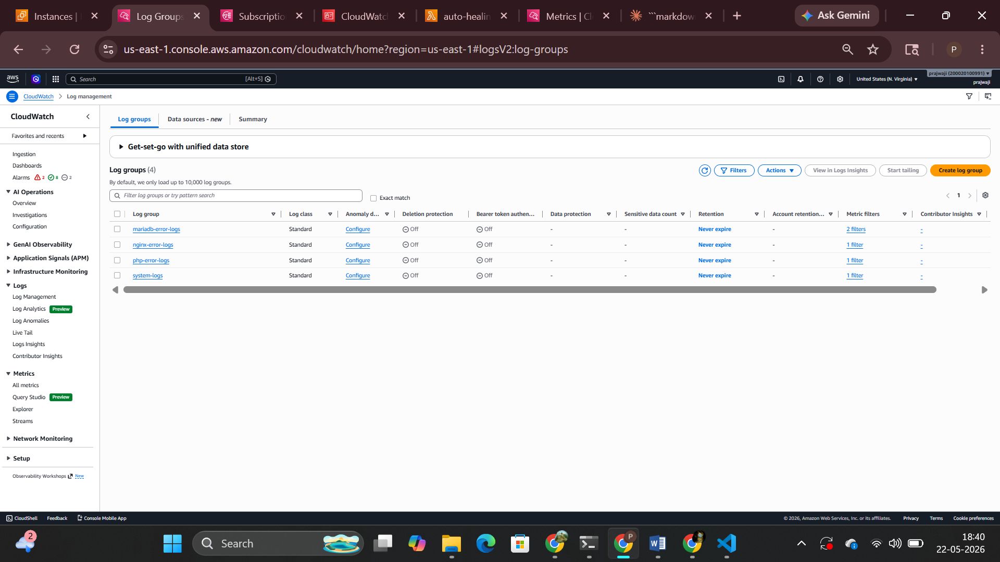

# REAL-TIME INFRASTRUCTURE MONITORING & ALERTING SYSTEM ON AWS

## Project Overview

This project is a Real-Time Infrastructure Monitoring & Alerting System on AWS designed to notify administrators about application-level failures running on EC2 instances.

It uses AWS Lambda and Amazon SNS to send real-time alert notifications when an incident is detected by external monitoring systems such as CloudWatch. The system focuses on delivering immediate incident awareness for critical services like NGINX, PHP-FPM, and application components running on EC2 instances within an Auto Scaling Group.

When triggered, the AWS Lambda function publishes a structured alert message to an SNS topic, which then sends notifications to subscribed users. The message includes details about the detected issue, the affected application service, and the recovery status.

Although the notification message includes a recovery statement, the current implementation is focused on alerting and incident reporting only, not actual service recovery.

Overall, this project demonstrates a serverless alerting pipeline using AWS Lambda and SNS for real-time infrastructure monitoring and incident communication.

---

---

## This Implementation Includes

- AWS Lambda for serverless alert processing
- Amazon SNS for real-time notification delivery
- Amazon CloudWatch for monitoring and alarm triggering
- Event-driven architecture for incident detection and reporting
- EC2-based application monitoring (NGINX, PHP-FPM, MariaDB services)
- Automated alert workflow using CloudWatch → Lambda → SNS

---
## Infrastructure Designed and Built from Scratch

As part of this project, I designed and implemented the entire AWS infrastructure from scratch, starting from the foundational networking layer to the application delivery layer.

The setup includes:

- VPC (Virtual Private Cloud)
- Public and Private Subnets
- Route Tables and Internet Gateway
- Security Groups for access control
- Application Load Balancer (ALB)
- EC2 instances inside an Auto Scaling Group
---

---
The Application Load Balancer distributes incoming traffic across multiple EC2 instances, ensuring high availability, scalability, and fault tolerance.

This hands-on implementation helped me understand real-world cloud architecture design, including:

- AWS networking fundamentals (VPC architecture)
- Subnet and routing design
- Traffic distribution using Load Balancer
- Scalable and highly available system design
- End-to-end cloud infrastructure deployment

---

## Launch Template with User Data Automation

As part of this project, I configured an EC2 Launch Template to automate instance provisioning inside the Auto Scaling Group.

The Launch Template includes a User Data script that runs automatically during instance bootstrapping. This script installs required packages, configures services, and prepares the instance for application deployment without any manual intervention.

Key Responsibilities of User Data Script:

- Install required packages (NGINX, PHP, MariaDB, etc.)
- Start and enable required services
- Configure application environment
- Automate instance initialization during launch


Benefit of This Approach:

- Fully automated instance setup
- No manual configuration required after launch
- Consistent configuration across all instances
- Faster deployment
- Production-ready automation
---

---

## Final Production Architecture

```
Users
  ↓
Application Load Balancer (ALB)
  ↓
Auto Scaling Group (EC2 Instances)
  ├── Launched using Launch Template
  ├── Bootstrapped using User Data Script
  ├── NGINX
  ├── PHP-FPM
  ├── MariaDB
  └── Application Code
        ↓
CloudWatch Agent + Custom Scripts
        ↓
Amazon CloudWatch
  ├── Metrics (CPU, Memory, Disk)
  ├── Logs (/var/log/*)
  └── Alarms (Service Failure Detection)
        ↓
AWS Lambda (Alert Processor)
        ↓
Amazon SNS (Notification Service)
        ↓
Email / SMS Notifications to Admins
```

---

## Technology Stack

| Category | Technology |
|---|---|
| Cloud Provider | Amazon Web Services |
| Compute | Amazon EC2 |
| Monitoring | Amazon CloudWatch |
| Alerting | Amazon SNS |
| Serverless | AWS Lambda |
| Web Server | NGINX |
| Database | MariaDB |
| Application | PHP-based Student Registration System |
| Auto Scaling | EC2 Auto Scaling Group |
| Load Balancer | Application Load Balancer (ALB) |
| Logging | CloudWatch Logs |
| Health Checks | Custom Bash Scripts |

---

## Project Folder Structure

```
project-root/
│
├── architecture/
│   ├── alb-flow.png
│   ├── autoscaling-flow.png
│   ├── aws-architecture.png
│   ├── Cloud-watch-Agent.png
│   ├── cloudwatch-alarm-flow.png
│   ├── Disk-usage-Alarm.png
│   ├── MariaDBAlarm.png
│   ├── MemoryAlarm.png
│   ├── NginxDownAlarm.png
│   ├── NginxErrorAlarm.png
│   ├── PhpErrorAlarm.png
│   ├── PHPMFPMDownAlarm.png
│   └── vpc-Architecture.png
│
├── Cloudwatch-Agent-update-config/
│   └── agent-config.json
│
├── images/
│   ├── cloud-watch-config.png
│   ├── Cpu greater then 75.png
│   ├── Disk-usage.png
│   ├── EC2-image.png
│   ├── labda-function.png
│   ├── logs.png
│   ├── mariadb-connected.png
│   ├── memory.png
│   ├── nginx-working.png
│   ├── php-app-out.png
│   ├── running.png
│   ├── subscription.png
│   ├── Topic-Sns.png
│   └── User Data Script.png
│
├── lambda/
│   ├── CloudwatchAgentRole.json
│   └── sns_alert.py
│
├── user-data-Script/
│   ├── cloud-watch-config
│   ├── mariadb.sql
│   ├── signup.html
│   └── submit.php
│
└── README.md
```

---

## Prerequisites

Before setting up this project, ensure the following are available:

An active Amazon Web Services account  
Basic knowledge of EC2 instance management  
Amazon EC2 instance (Amazon Linux / Ubuntu)  
IAM role with permissions for CloudWatch, SNS, and Lambda  
Amazon CloudWatch configured for metrics and logs  
Amazon Simple Notification Service topic created for alerts  
AWS Lambda function setup for alert handling  
NGINX, PHP, and MariaDB installed on EC2 instances  
Basic Linux command-line knowledge  
Python installed for Lambda development (boto3 support included)

---

# Installation Steps

Follow these steps to set up the project:

---

## 1. Launch EC2 Instance

Create an EC2 instance using Amazon Web Services.

- Choose Amazon Linux or Ubuntu  
- Allow ports:
  - 80 (HTTP)
  - 22 (SSH)

---


---

## 2. Install Required Services

```bash
sudo yum update -y
sudo yum install nginx -y
sudo yum install php -y
sudo yum install mariadb-server -y
```

Start services:

```bash
sudo systemctl start nginx
sudo systemctl start php-fpm
sudo systemctl start mariadb
```

---

---

## 3. Configure CloudWatch Agent

```bash
sudo yum install amazon-cloudwatch-agent -y
```

Config file path:

```
/opt/aws/amazon-cloudwatch-agent/etc/amazon-cloudwatch-agent.json
```

---

---

## 4. Create SNS Topic

- Create topic: production-alert-topic  
- Add email subscription  
- Confirm subscription via email  

***

---


---

## 5. Deploy Lambda Function

- Runtime: Python 3.12  
- Add IAM role with SNS permission  
- Paste Lambda SNS code  
- Attach CloudWatch alarm trigger  

---

---

## 6. Configure CloudWatch Alarms

| Alarm Name | Purpose |
|---|---|
| NginxErrorAlarm | Detects NGINX errors |
| PHPErrorAlarm | Detects PHP errors |
| MariaDBErrorAlarm | Detects DB errors |
| NginxDownAlarm | Service down detection |
| PHPFPMDownAlarm | Service down detection |
| MariaDBDownAlarm | Service down detection |
| MemoryAlarm | High memory usage |
| HighCPUAlarm | CPU monitoring |
| SystemErrorAlarm | System logs |
| TargetTracking-ASG-* | Auto Scaling policies |

---
## Resource Utilization Alerts   ← ADD HERE


- CPU Utilization > 75% → Trigger ALERT  
---

---
- Memory Utilization > 40% → Trigger ALERT  
---


---
- Disk Usage > 40% → Trigger ALERT  
---


---

## Configured Log Groups

| Log Group | Purpose |
|---|---|
| nginx-error-logs | NGINX logs |
| php-error-logs | PHP logs |
| mariadb-error-logs | DB logs |
| system-logs | OS logs |

---

---

## 7. Health Check Scripts

Place scripts in EC2.

### Service Health Check Script (Cron Automation)

This project contains a simple health monitoring script for Linux services like:

- Nginx
- PHP-FPM
- MariaDB

---

### 🎯 Why This Is Created

This script is created to:

- Automatically check if critical services are running
- Detect service failure (Down state)
- Help in system monitoring and auto-alert setups
- Support DevOps monitoring and AWS learning projects

---

### ⏱️ How It Works

- Runs every 1 minute using cron job
- Uses `systemctl is-active` to check service status
- Logs or prints message if service is down

Make scripts executable:

```bash
chmod +x nginx_check.sh php_fpm_check.sh mariadb_check.sh
```

---

## Schedule Using Cron

### Installation

Create directory:

```bash
sudo mkdir -p /opt
```

Open crontab:

```bash
crontab -e
```

Create script:

```bash
sudo nano /opt/service-watch.sh
```

Paste this:

```bash
#!/bin/bash

REGION="us-east-1"
NAMESPACE="StudentApp"

# Nginx Check
if systemctl is-active --quiet nginx
then
    aws cloudwatch put-metric-data \
    --region $REGION \
    --namespace $NAMESPACE \
    --metric-name NginxDown \
    --value 0
else
    aws cloudwatch put-metric-data \
    --region $REGION \
    --namespace $NAMESPACE \
    --metric-name NginxDown \
    --value 1
fi

# PHP-FPM Check
if systemctl is-active --quiet php-fpm
then
    aws cloudwatch put-metric-data \
    --region $REGION \
    --namespace $NAMESPACE \
    --metric-name PHPFPMDown \
    --value 0
else
    aws cloudwatch put-metric-data \
    --region $REGION \
    --namespace $NAMESPACE \
    --metric-name PHPFPMDown \
    --value 1
fi

# MariaDB Check
if systemctl is-active --quiet mariadb
then
    aws cloudwatch put-metric-data \
    --region $REGION \
    --namespace $NAMESPACE \
    --metric-name MariaDBDown \
    --value 0
else
    aws cloudwatch put-metric-data \
    --region $REGION \
    --namespace $NAMESPACE \
    --metric-name MariaDBDown \
    --value 1
fi
```


---

## Step 12 — Test Monitoring System

Stop NGINX:

```bash
sudo systemctl stop nginx
```

Expected flow:

```text
NGINX Stops
     ↓
CloudWatch Detects Issue
     ↓
Alarm State Changes
     ↓
Lambda Executes
     ↓
SNS Notification Sent
```

Same process applies for:

- php-fpm
- mariadb105-server

---

## 8. Test System

- Stop NGINX or PHP-FPM manually
- Verify CloudWatch alarm triggers
- Check SNS email alert
- Confirm Lambda execution

---

##  Advantages vs Disadvantages

|  ADVANTAGES |  DISADVANTAGES |
|---|---|
| Simple and lightweight | No real-time alerts |
| Automatic monitoring | Not scalable |
| Quick failure detection | No central dashboard |
| Low cost solution | Manual maintenance |
| Easy DevOps learning | Limited error details |
| Foundation for AWS upgrade | Cron dependency risk |

---

## Automation vs  Manual

|  AUTOMATION |  MANUAL |
|---|---|
| Runs automatically | Requires human intervention |
| Fast execution | Slow process |
| Reduces human errors | High chance of mistakes |
| Works 24/7 | Cannot run continuously |
| Scalable | Not suitable for large systems |
| Better for DevOps & production | Mostly for testing |

---

#  Features

- Real-time monitoring
- Infrastructure observability
- Log monitoring
- Centralized logging
- Automated alert notifications
- Application health tracking
- AWS cloud-native monitoring

---

## Production-Oriented Monitoring Architecture Improvement

During the implementation, I initially configured CloudWatch metrics and log monitoring at the individual EC2 instance level. After completing the project, I realized that this approach was not ideal for a production-style scalable environment because instances inside an Auto Scaling Group are temporary and can be dynamically created or terminated.

I understood that a better production approach would be to redesign the monitoring architecture at the Auto Scaling Group level instead of depending on a single EC2 instance.

This would provide advantages such as:

- Automatic monitoring for newly launched instances  
- Better scalability and high availability  
- Centralized monitoring architecture  
- More production-ready cloud design  

If I continue this project in the next version, I would implement:

- CloudWatch Agent integration with Auto Scaling  
- Shared CloudWatch alarms and metrics  
- Centralized log collection  
- Event-driven alerting using Lambda and SNS  

This realization helped me better understand real-world cloud monitoring architecture and production-oriented DevOps practices.

---

## Conclusion

This project demonstrates a real-world, production-style AWS monitoring and alerting system built using a fully serverless and event-driven architecture. It successfully integrates AWS services such as EC2, Auto Scaling Group, CloudWatch, Lambda, and SNS to achieve centralized monitoring and real-time alerting for critical application services.

By designing and implementing the entire infrastructure from scratch, including VPC networking, subnets, route tables, and an Application Load Balancer, this project helped reinforce strong foundational knowledge of cloud architecture and networking concepts.

The use of CloudWatch metrics, log monitoring, and custom health check scripts enabled proactive detection of service failures. The integration of Lambda and SNS ensured immediate notification delivery to administrators, improving incident awareness and response time.

Additionally, implementing Launch Templates with user data automation provided hands-on experience with infrastructure automation and instance provisioning in an Auto Scaling environment.

Overall, this project strengthened my understanding of:

- AWS cloud architecture and networking
- Scalable system design using Auto Scaling Groups
- Monitoring and observability using CloudWatch
- Event-driven automation using Lambda and SNS
- Infrastructure automation using Launch Templates and User Data

This project serves as a strong foundation for building production-grade DevOps and cloud-native systems.

---

